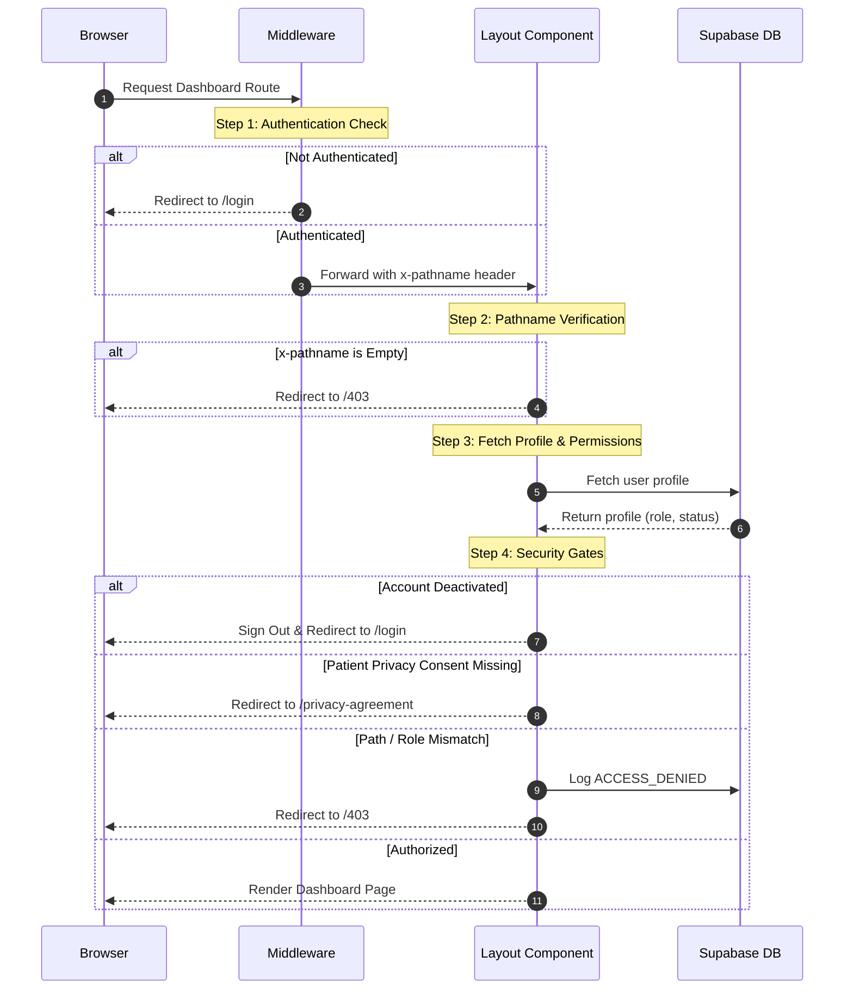

# System Architecture Guide
*Overview of layouts, authentication gates, component splitting, and integrations in KlinikAid*

This document provides a detailed breakdown of the architectural concepts, folder structures, security boundaries, and API integrations of the KlinikAid portal.

---

## Route Group Separation

Next.js routing in `src/app/` is divided into two primary route groups to isolate layouts and access patterns:

1. **Authentication Route Group `(auth)/`**
   - **Routes**: `/login`, `/register`, `/privacy-agreement`
   - **Purpose**: Provides standard auth forms and consent agreements. These routes share the minimal root layout (rendering standard login/register page containers without the admin sidebar).
   
2. **Dashboard Route Group `(dashboard)/`**
   - **Routes**: `/admin/*`, `/reception/*`, `/department/*`, `/specialist/*`, `/patient/*`
   - **Purpose**: Houses the core application workspaces. Pages rendered under this group share `(dashboard)/layout.tsx`, which attaches the navigation sidebar, sets up real-time handlers, and enforces the role gates.

---

## Layout-Level Role Gate (RBAC)

KlinikAid implements a **fail-closed layout-level role gate** to protect dashboard routes. It works in tandem with Next.js Middleware:

### Critical Rules of the Gate
- **Fail-Closed Redirection**: If the `x-pathname` header is missing or empty, the gate denies access and redirects to `/403`.
- **Privacy Gate Intercept**: Any logged-in patient with a null `accepted_privacy_at` timestamp is redirected to `/privacy-agreement` before loading any other dashboard layout children.
- **Audit Logging**: Any unauthorized route access attempt triggers a server-side `logEvent` writing an `ACCESS_DENIED` record into `system_logs` (tracking IP address, user ID, attempted path, and user role).

---

## Server vs. Client Component Split

KlinikAid strictly enforces the separation of server data fetching and client-side interactivity (**Standing Rule #7**):

- **Server Component (`page.tsx`)**:
  - Handles authentication validation on the server via `supabase.auth.getUser()`.
  - Performs initial queries and database fetching.
  - Passes read-only data down to client components as typed props.
  - Keeps environment variables and db calls hidden from the browser.
- **Client Component (`[Feature]Client.tsx`)**:
  - Resides in the same folder as `page.tsx` (co-located).
  - Uses `"use client"`.
  - Handles React hooks, state management, transitions, event triggers, and charts.

---

## Server Actions vs. API Routes

Communication between the browser and the backend is separated based on the target client:

1. **Server Actions (Web Portal)**:
   - Used for portal-specific form submissions, updates, and mutations (e.g. creating patients, accepting privacy consent, approving documents).
   - Require authentication sessions as their first executable line (`supabase.auth.getUser()`).
   - Throw typed structured responses using `errorResponse()` or `successResponse()` to ensure the UI client gets clean, actionable notifications.

2. **API Routes (Shared Endpoint)**:
   - Reside in `src/app/api/`.
   - Used for queries shared with the mobile application client or for operations needing standard REST access (e.g., `/api/chat`, `/api/admin/staff`).
   - Enforce session checks. Do not expose service-role credentials to clients.

---

## Shared Utilities & Library Structure

Global logic is stored under `src/lib/` to avoid redundancy:

- `src/lib/supabase/`: Exposes separate client initializers:
  - `server.ts`: Initializer for Server Components/Actions.
  - `client.ts`: Initializer for Client Components.
  - `middleware.ts`: Initializer for route-based session updates.
  - `admin.ts`: Initializer using `SUPABASE_SERVICE_ROLE_KEY` (restricted to critical server-only queries).
- `src/lib/auth/helpers.ts`: Exposes `requireRole(roles[])` to quickly validate active sessions and role memberships.
- `src/lib/logger.ts`: Implements `logEvent(supabase, userId, eventType, description, ipAddress?, metadata?)` to populate `system_logs`.
- `src/lib/constants.ts`: System constants, role metadata, reference ranges, and `SYSTEM_EVENT_TYPES`.
- `src/lib/utils.ts`: Formatters like `formatPhTime(date)` (locks format to UTC+8) and `getAge(dob)`.

---

## RAG / Chatbot Execution Pipeline

The AI chatbot endpoint at `/api/chat` coordinates RAG grounding and Gemini interactions:

1. **Auth & Rate Limiting**: Verifies the session and checks `chatbot_logs` for requests by the user ID in the past hour. If requests $\ge 20$, returns an HTTP `429` error.
2. **Embedding Generation**: Processes the user's text query through Gemini's `gemini-embedding-001` with `outputDimensionality: 768` to get a 768-dimensional vector.
3. **Similarity Search**: Invokes the `match_documents` SQL RPC function, scanning `rag_documents` to find matches matching a cosine similarity threshold of `0.6` (limit 5).
4. **Prompt Grounding**: Injects the matched text contents into a strict system prompt instruction, forcing Gemini to base its answers **only** on the context.
5. **Model Query**: Sends the grounded history to `gemini-2.5-flash`.
6. **Logging**: Writes the message, bot response, session ID, and token usage count into `chatbot_logs`.

---

## Supabase Private Storage Bucket

Patient uploads are stored securely in a private Supabase Storage bucket named `patient-documents`:

- **Path Schema**: Files are named under `${profile_id}/${uuid}.${file_extension}` to keep user directories strictly isolated.
- **Access Policies**: Storage RLS restricts patients to upload/select/delete files under their own directory prefix. Admins and Receptionists hold select privileges across all prefixes.
- **Signed URL Delivery**: Client-side components never access files via public URLs. Instead, the server generates temporary signed URLs using `createSignedUrl` which expire in seconds, keeping raw documents inaccessible from the public web.
